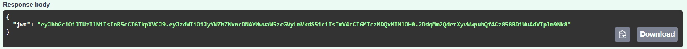
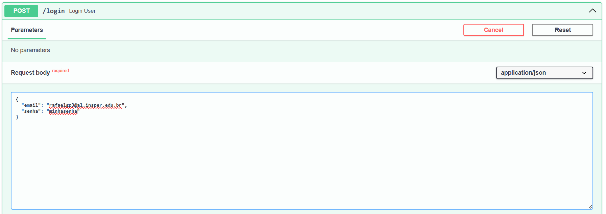
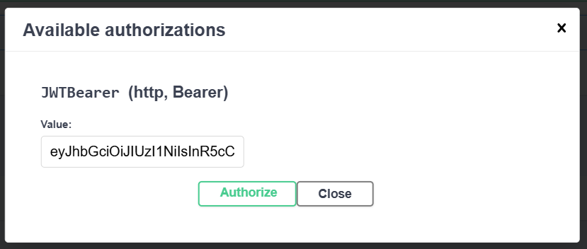

# Projeto de Computação em Nuvem, 6° semestre de Engenharia da Computação do Insper

Desenvolvido por Rafael Gordon Paves.

## Sobre o projeto

Nesse projeto, foi feita uma API conectada a um banco de dados Postgres, em uma aplicação conteinerizada.

Um dos requisitos era fazer um web scraping ou usar uma api atualizada regularmente. Neste projeto, escolhi [Jikan](https://jikan.moe/), uma api com dados de animes, mangás, personagens, produtoras, usuários, entre outros que estão no site MyAnimeList.

## Executando a aplicação

1. Baixe o [compose.yaml](./compose.yaml):

2. No mesmo diretório do compose.yaml, rode o conteiner:
```
docker compose up
```

3. Para testar, pode entrar na documentação própria do FastAPI (Swagger) em http://localhost:8000/docs 

4. Quando quiser sair, pare o conteiner (rode esse comando em outro terminal):
```
docker compose down
```


## Rotas

**POST /registrar**
- Requer no corpo da requisição 3 chaves: "email", "nome" e "senha".
- Em sucesso, devolve um token jwt, com expiração de 30 minutos, no formato {"jwt": ${token}}


Exemplo de corpo da requisição:

Exemplo de resultado:


**POST /login**
- Requer no corpo da requisição 2 chaves: "email" e "senha".
- Em sucesso, devolve um token jwt, com expiração de 30 minutos, no formato {"jwt": ${token}}


Exemplo de corpo da requisição

Exemplo de resultado:


**GET /consulta**
- Requer no cabeçalho um token jwt válido (obtido a partir das rotas registrar ou login)
- Em sucesso, devolve dados de um anime aleatório da API mencionada anteriormente pela rota https://api.jikan.moe/v4/random/anime. Alguns dados retornados incluem o nome do anime, data de lançamento, gêneros, sinopse, estúdio que produziu, entre outros.

Clique no cadeado para autenticação:


Coloque o token obtido anteriormente:



Um exemplo de resultado:


## Links

[Link para o DockerHub da imagem](https://hub.docker.com/repository/docker/rafaelgp3/projetocloud-fastapi/general)

[Compose.yaml](./compose.yaml)
