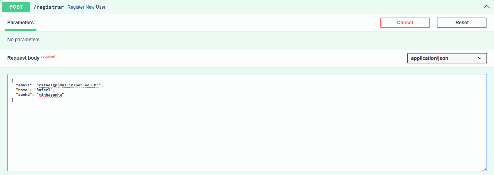
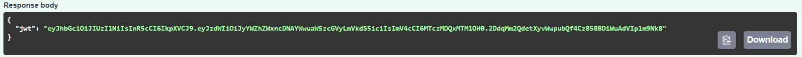
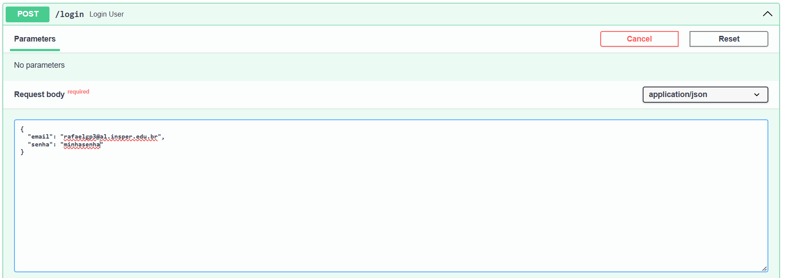
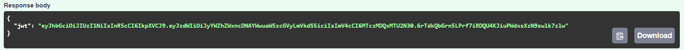
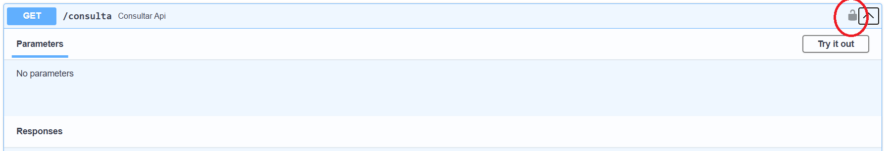
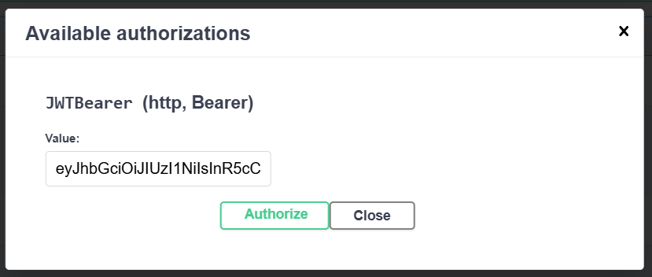
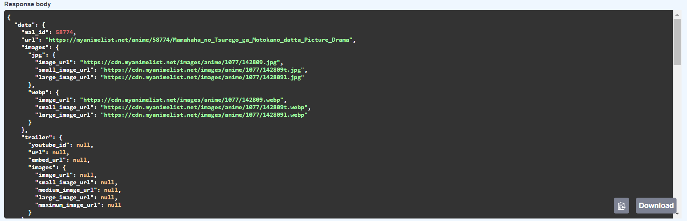

## Sobre a etapa 1

Na primeira etapa, foi feita uma API conectada a um banco de dados Postgres, em uma aplicação conteinerizada, com o intuito de aprender conceitos como Docker, autenticação JWT, AWS, APIs, entre outros. 

Um dos requisitos era fazer um web scraping ou usar uma api atualizada regularmente. Neste projeto, escolhi [Jikan](https://jikan.moe/), uma api com dados de animes, mangás, personagens, produtoras, usuários, entre outros que estão no site MyAnimeList.

## Executando a aplicação

1. Baixe o [compose.yaml](https://github.com/rafaelgpaves/projeto-cloud/blob/main/compose.yaml) ou copie:

```
name: projeto

services:

  db:
    image: postgres:17
    environment:
      - POSTGRES_DB=${POSTGRES_DB:-projeto} 
      - POSTGRES_USER=${POSTGRES_USER:-projeto}
      - POSTGRES_PASSWORD=${POSTGRES_PASSWORD:-projeto}
    ports:
      - 5432:5432
    healthcheck:
      test: ["CMD-SHELL", "pg_isready -U ${POSTGRES_USER:-projeto} -d ${POSTGRES_DB:-projeto}"]
      interval: 10s
      retries: 5
      start_period: 30s
      timeout: 10s

  app:
    image: rafaelgp3/projetocloud-fastapi:v1
    environment:
      - POSTGRES_DB=${POSTGRES_DB:-projeto} 
      - POSTGRES_USER=${POSTGRES_USER:-projeto}
      - POSTGRES_PASSWORD=${POSTGRES_PASSWORD:-projeto}
    ports:
      - 8000:8000
    depends_on:
      db:
        condition: service_healthy
        restart: true
```

2. No mesmo diretório do compose.yaml, rode o conteiner:
```
docker compose up
```

3. Para testar, pode entrar na documentação própria do FastAPI (Swagger) em http://localhost:8000/docs 

4. Quando quiser sair, pare o conteiner (rode esse comando em outro terminal):
```
docker compose down
```


## Rotas

**POST /registrar**
- Requer no corpo da requisição 3 chaves: "email", "nome" e "senha".
- Em sucesso, devolve um token jwt, com expiração de 30 minutos, no formato {"jwt": ${token}}


Exemplo de corpo da requisição:

Exemplo de resultado:


**POST /login**
- Requer no corpo da requisição 2 chaves: "email" e "senha".
- Em sucesso, devolve um token jwt, com expiração de 30 minutos, no formato {"jwt": ${token}}


Exemplo de corpo da requisição:

Exemplo de resultado:


**GET /consulta**
- Requer no cabeçalho um token jwt válido (obtido a partir das rotas registrar ou login)
- Em sucesso, devolve dados de um anime aleatório da API mencionada anteriormente pela rota https://api.jikan.moe/v4/random/anime. Alguns dados retornados incluem o nome do anime, data de lançamento, gêneros, sinopse, estúdio que produziu, entre outros.

Clique no cadeado para autenticação:



Coloque o token obtido anteriormente:



Um exemplo de resultado:




## Dockerização

Para criar a imagem, foram feitos esses passos:


Entrar no diretório com a `Dockerfile`:
```
cd app
```

Usar dockerx (para criar imagens para múltiplas arquiteturas):
```
docker buildx create --use
```

Criar a imagem e dar push para o DockerHub:
```
docker buildx build --platform linux/amd64,linux/ar64 -t rafaelgp3/projetocloud-fastapi:v1.0 -t rafaelgp3/projetocloud-fastapi:latest . --push
```


## Links

[Vídeo mostrando as rotas](https://youtu.be/KObsd64bpaA)

[Link para o DockerHub da imagem](https://hub.docker.com/repository/docker/rafaelgp3/projetocloud-fastapi/general)

[Compose.yaml](https://github.com/rafaelgpaves/projeto-cloud/blob/main/compose.yaml)
